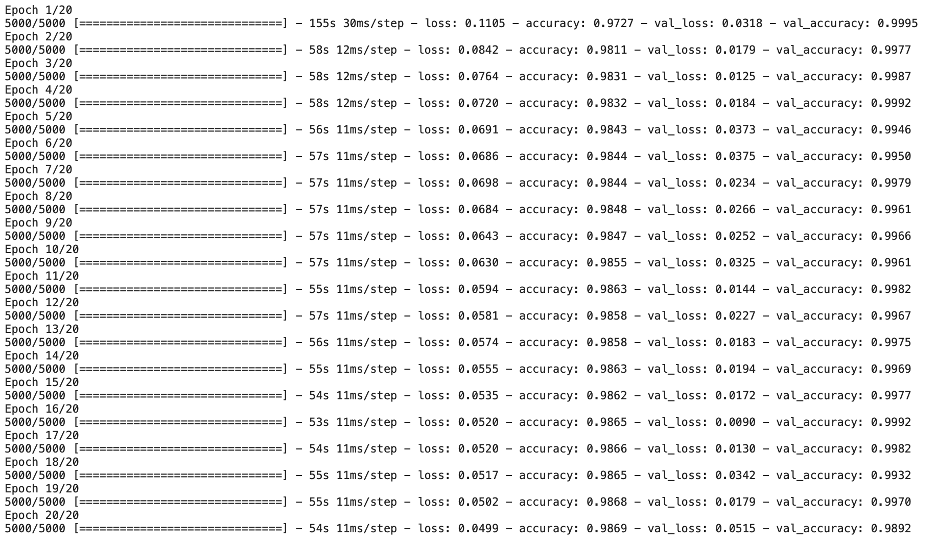
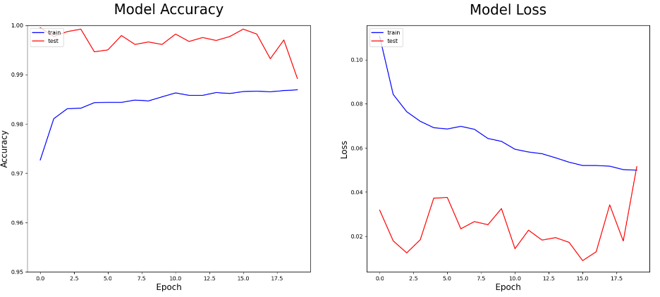

# Detection Algorithm for Bridge Cracks Based on Deep Learning
Link : https://www.kaggle.com/code/siriyasriboonma/deep-learning-cnn

## Introduction
This project aims to detect bridge cracks surface as normal and crack surface based on deep learning, Convolutional Neural Network, using TensorFlow Keras. The dataset is from https://github.com/Charmve/Surface-Defect-Detection/tree/master/Bridge_Crack_Image.

This dataset is divided into two part:
1.	Train dataset contains 50,000 images of both normal and crack surface images. The label of this dataset is provided in train.txt file.
2.	Validation dataset contains 5,000 images of both normal and crack surface images. The label of this dataset is provided in val.txt file.
Since there is no test dataset, this project will use validation dataset as test data and use 20% of train dataset to be validation dataset.

## Import Libraries
The libraries which have been used in this project are shown as below.
```sh
import numpy as np 
import pandas as pd
import matplotlib.pyplot as plt
from matplotlib import image

from PIL import Image

import seaborn as sns
import plotly.express as px

from pathlib import Path

import os

import tensorflow as tf
from keras.callbacks import ModelCheckpoint

from sklearn.metrics import confusion_matrix, classification_report
```

## Data Preprocessing

## Modeling Process
1. Parameter Setting : I set the parameter image_width and image_height = 16 equal to the image size which is 16x16. The image_color_channel_size = 255 due to RGB. 
```sh
## image_widht
image_widht = 16
## image_height
image_height = 16
## image_color_channel_size
image_color_channel_size = 255
## image_size
image_size = (image_widht, image_height)
## batch_size
batch_size = 8
## epochs
epochs = 20
## learning_rate
learning_rate = 0.01
## class_names
class_names = ['Normal','Crack']
```
2. Loading Image and Rescaling : The tf.keras.preprocessing.image.ImageDataGenerator is used to convert image to array and rescale image. For train_gen, I set validation_split = 0.2 which is 20% of 50,000 images.
```sh
train_gen = tf.keras.preprocessing.image.ImageDataGenerator(
    rescale=1./image_color_channel_size,
    validation_split=0.2
)

test_gen = tf.keras.preprocessing.image.ImageDataGenerator(
    rescale=1./image_color_channel_size
)
```
Then, I load images from path in train_df and test_df the I have crated by using ImageDataGenerator.flow_from_dataframe. The parameter class_mode = binary because there are only two labels in this project which are ‘Normal’ and ‘Crack’. This can separate data into train, validation, and test. 
```sh
train_data = train_gen.flow_from_dataframe(
    train_df,
    x_col='filename',
    y_col='label',
    target_size=image_size,
    color_mode='rgb',
    class_mode='binary',
    batch_size=batch_size,
    shuffle=True,
    seed=42,
    subset='training'
)

val_data = train_gen.flow_from_dataframe(
    train_df,
    x_col='filename',
    y_col='label',
    target_size=image_size,
    color_mode='rgb',
    class_mode='binary',
    batch_size=batch_size,
    shuffle=True,
    seed=42,
    subset='validation'
)

test_data = test_gen.flow_from_dataframe(
    test_df,
    x_col='filename',
    y_col='label',
    target_size=image_size,
    color_mode='rgb',
    class_mode='binary',
    batch_size=batch_size,
    shuffle=False,
    #seed=42
)
```
3. Training Model : Model is created by using TensorFlow Keras. First, the input layer is called by tf.keras.Input with shape = 16x16 as an image size and 3 refer to RGB color. In this project, I build two convolution layers. The first one contains 64 filters and the second one contains 128 filter layers. I set kernel_size 2x2 and use activation function as ReLu. And I also build Pooling two layers by using MaxPool size 2x2. Sequence of the model is shown in figure 11. Then, I use GlobalAveragePooling2D() to convert the output data from 2D to a 1D, which can then be fed into a fully connected layer. After that, in the output layer, I use the activation function as Sigmoid because the output of this model is binary.
- The optimizer of this model is Adam with a learning rate 0.01 that I have set in the parameter setting.  The loss function of this model is binary_crossentropy and use accuracy for performance matrices.
- This model is trained with 40,000 training data in 20 epochs with batch size = 8, 10,000 validation data is used to validate this model.
```sh
inputs = tf.keras.Input(shape=(16,16,3))
x = tf.keras.layers.Conv2D(filters=64, kernel_size=(2, 2), activation='relu')(inputs)
x = tf.keras.layers.MaxPool2D(pool_size=(2, 2))(x)
x = tf.keras.layers.Conv2D(filters=128, kernel_size=(2, 2), activation='relu')(x)
x = tf.keras.layers.MaxPool2D(pool_size=(2, 2))(x)
x = tf.keras.layers.GlobalAveragePooling2D()(x)
outputs = tf.keras.layers.Dense(1, activation='sigmoid')(x)

model = tf.keras.Model(inputs=inputs, outputs=outputs)
```
```sh
model.compile(
    optimizer=tf.keras.optimizers.Adam(learning_rate = learning_rate),
    loss='binary_crossentropy',
    metrics=['accuracy']
)
```
```sh
history = model.fit(
    train_data,
    validation_data=val_data,
    epochs=epochs,
    batch_size=batch_size,
)
```
## Results and Predictions
As a result, the accuracy of this model is 0.9869 with loss 0.0515. The longer the model train, the more accuracy and the lease loss as below.




After using this model to predict data in the test data set, the confusion matrix is used to evaluate this model. The True Positive and True Negative is high which means the model can predict mostly correctly as you can see in the report as below.
